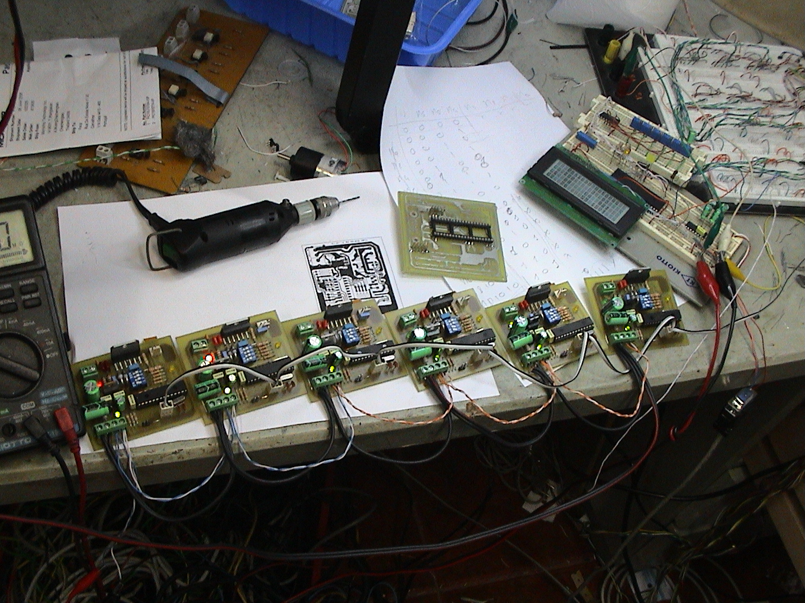
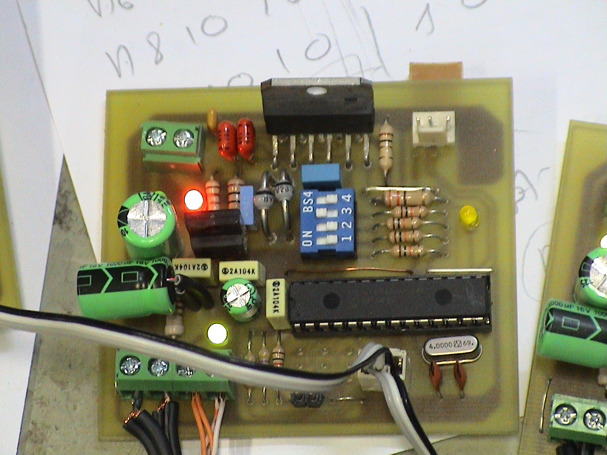
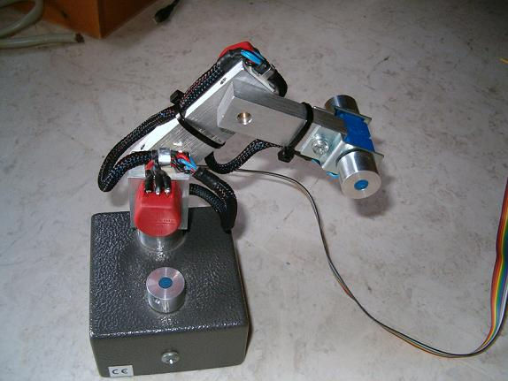
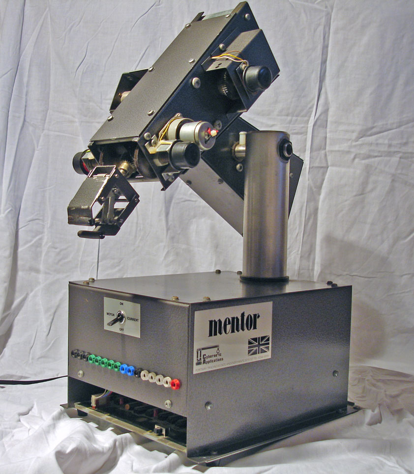
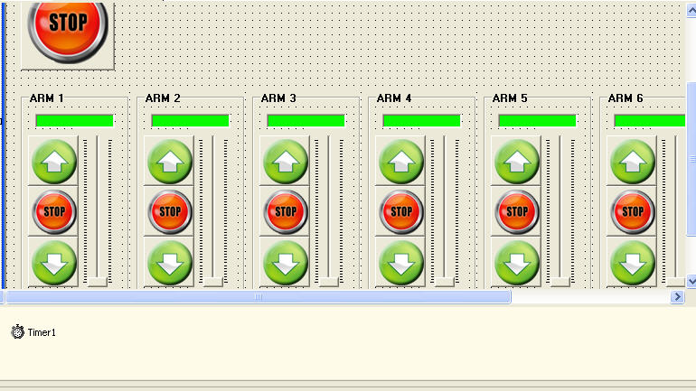

## Synopsis

Distributed Controller for Mentor Robot Arm with 6DOF.  
The Slave Cards control each of the axis and the Master Card manages comunications between the Software and each of the Slave Cards and the user Joystick.  
The user can guide the arm with the Software or using just the Joystick to interact with the arm.  
The values are show in the Master Card display.

 
## Features 

User can swap the cards only need to define the slave address, interact with the arm by joystick or software.

## Videos/Images

Overhal System.  

Slave Card.  

Joystick.  

Joystick.  

Software.  

## Contributors

Main Developer :HSO  
Email: hugo(dot)soares(at)fe(dot)up(dot)pt
